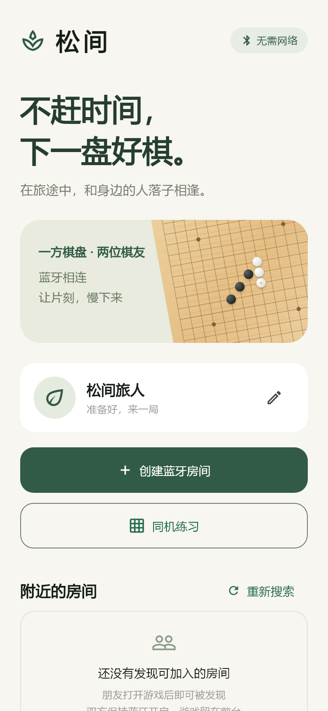
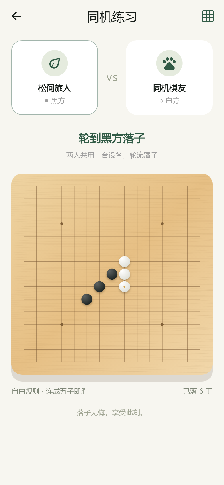

<div align="center">

# 松间五子棋 · Pine Gomoku

**不赶时间，下一盘好棋。**

基于 Flutter 的 Android / iOS 离线蓝牙五子棋，让旅途中的两位棋友无需网络也能面对面对弈。

[功能介绍](#功能介绍) · [快速开始](#快速开始) · [蓝牙对弈](#蓝牙对弈) · [构建安装包](#构建安装包) · [验证状态](#验证状态)

</div>

## 界面预览

<p align="center">
  
  &nbsp;&nbsp;
  
</p>

> 截图来自实际 Flutter 界面渲染。当前版本已通过本地自动测试并成功构建 Android 测试安装包；iOS 构建与跨设备蓝牙互通仍需进一步验证。

## 功能介绍

| 功能 | 说明 |
| --- | --- |
| 附近棋友 | 打开大厅后自动搜索，并在设备支持时广播可加入状态 |
| 蓝牙房间 | 创建房间等待朋友，也可直接加入附近棋友 |
| 双端同步 | 同步落子、回合、棋局结果、昵称和头像 |
| 精致棋盘 | 15×15 木纹棋盘、立体黑白棋子、末手标记、胜利连线 |
| 个人资料 | 默认昵称与头像、8 款内置头像、相册头像、本地保存 |
| 同机练习 | 两人共用一台设备，完全不需要蓝牙 |
| 异常处理 | 消息分片与校验、状态确认、心跳、超时和断线冻结 |

**规则：** 房主执黑先行，双方轮流落子；横、竖或斜向连续至少五子即胜。采用自由规则，无禁手；满盘无胜者为和棋。终局后禁止继续落子。

## 快速开始

### 环境要求

| 工具 / 平台 | 版本 |
| --- | --- |
| Flutter | 3.47.2 stable（本地验证版本） |
| Dart | 随 Flutter 安装，验证版本为 3.13.2 |
| Android | Android 7.0 / API 24 及以上 |
| iOS | iOS 15.0 及以上 |
| Android 构建工具 | JDK 21、SDK Platform 36、Build Tools 36.0.0、NDK 28.2.13676358 |
| iOS 构建工具 | macOS、Xcode；真机安装需要 Apple 开发签名 |

部分依赖还会使用 Android SDK Platform 34，请允许构建工具安装缺少的 SDK 组件。依赖版本已通过 `pubspec.lock` 锁定。

```sh
git clone https://github.com/fushen1024/five-in-a-row.git
cd five-in-a-row
flutter pub get
flutter run
```

运行前连接 Android 手机或 iPhone。模拟器可以帮助检查界面，但不能代替真实 BLE 对弈测试。

## 蓝牙对弈

1. 双方打开游戏，开启蓝牙并授予所需权限，保持游戏在前台。
2. 一方点击“创建蓝牙房间”，另一方在附近列表点击加入；也可以直接加入仍停留在大厅的棋友。
3. 交换资料成功后进入对局，被加入者执黑，加入者执白。
4. 按提示轮流落子，双方屏幕同步显示棋盘和获胜结果。

附近列表每次搜索持续 20 秒，点击“重新搜索”可以刷新。Android 11 及以下需要定位权限，部分设备还要求开启系统定位服务。游戏业务不依赖 Wi-Fi、移动网络或服务器。

**设备限制：** 部分 Android 设备不支持 BLE peripheral / 广播模式，只能加入其他设备。后台挂起或连接中断后会冻结本局，需要返回大厅重新连接；当前不支持断线续局。

**资料限制：** 昵称最多 16 个字符；相册头像裁剪为 64×64 JPEG，并限制为 6 KB，以适应蓝牙传输。资料仅保存在本机并发送给同局棋友。

## 构建安装包

### Android

```sh
flutter build apk --debug
```

输出：`build/app/outputs/flutter-apk/app-debug.apk`。

连接开启 USB 调试的手机后，也可以使用：

```sh
flutter install --debug
```

这是开发测试包。当前 release 配置仍使用开发签名，正式分发前需要配置自己的 release 签名。Flutter debug 包包含调试所需的网络权限，游戏逻辑本身不需要联网。

### iOS

在 Mac 上执行：

```sh
flutter pub get
flutter build ios --no-codesign
open ios/Runner.xcworkspace
```

在 Xcode 中为 `Runner` 选择自己的 Team 和唯一的 Bundle Identifier，连接 iPhone 后运行。按所用集成方式准备 Swift Package Manager 或 CocoaPods；正式分发需要开发者完成签名与归档。

### GitHub Actions

仓库包含 [双平台构建工作流](.github/workflows/mobile.yml)：

- Android：静态检查、自动测试、生成 debug APK，并上传名为 `pine-gomoku-android-debug` 的构建产物。
- iOS：在 macOS runner 上尝试未签名构建。

可在仓库 **Actions → Mobile verification** 查看实际运行结果；成功的 Android 运行可下载 APK 构建产物。构建工作流不包含真机蓝牙测试。

## 验证状态

| 检查 | 本地结果 |
| --- | --- |
| 静态分析 | 通过，无问题 |
| 自动测试 | 24 项通过 |
| Android debug APK 构建 | 通过 |
| APK 签名与应用信息检查 | 通过 |
| Android / iOS 权限配置解析 | 通过 |
| 手机、小屏及横屏界面 | 已验证 390×844、320×568、844×390 |
| iOS 原生构建和签名 | 尚未在本地执行 |
| Android ↔ Android、iOS ↔ iOS、Android ↔ iOS 蓝牙互通 | 待真机验收 |

```sh
flutter analyze
flutter test
```

测试覆盖四方向胜利、满盘和棋、非法落子、消息分片与乱序、资料校验、双端整局同步、握手超时、断线冻结、蓝牙就绪等待及页面交互。

完整记录见 [验证记录](docs/verification.md)，真机操作步骤见 [设备验收清单](docs/device-testing.md)。

## 项目结构

```text
lib/
├── domain/                 # 棋局规则、玩家资料、消息分片
├── services/ble_link.dart   # BLE 广播、连接、通知与资源释放
├── session.dart            # 房主权威状态、握手、落子、确认和心跳
├── ui/                     # 棋盘绘制、头像与资料编辑
└── main.dart               # 大厅、附近发现与对局页面
android/                    # Android 原生工程
ios/                        # iOS 原生工程
test/                       # 自动测试
docs/                       # 设计、预览、验证与真机清单
.github/workflows/          # 双平台构建工作流
tool/                       # 本地辅助与源码打包脚本
```

## 技术方案

- **Flutter / Dart**：共用界面与棋局规则。
- **universal_ble 2.2.0**：通过 BLE central / peripheral 模式连接手机。
- **shared_preferences**：保存昵称和头像。
- **image_picker / image**：选择照片、裁剪和压缩头像。
- **房主权威同步**：访客发送带局号与步号的请求，由房主校验后同步棋谱；双方确认状态，防止异常情况下继续落子。
- **小包传输**：单个分片不超过 20 字节，兼容默认 ATT MTU，并校验分片顺序和长度。

设计与实施记录：[设计文档](docs/design.md) · [实施计划](docs/plan.md)。

## 参与改进

欢迎通过 Issues 描述问题、设备型号、系统版本和复现步骤，或提交 Pull Request。请勿在问题报告中上传私密照片、凭据或签名文件。

源码仓库不包含本机 SDK、构建缓存、私钥或 APK 大文件。`tool/flutter.ps1` 供已有项目内 `.tools/flutter` 的本地环境使用；新克隆请优先使用标准 `flutter` 命令。
